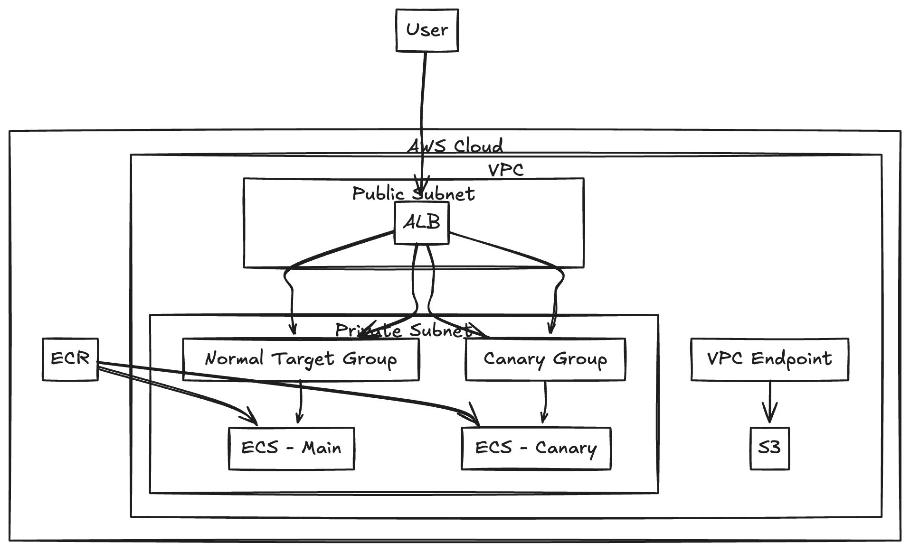

## Overview

Example for Amazon ECS Canary Service



## How to use

1. Run up

    ```bash
    docker compose up --build
    ```

2. Terraform apply

    ```bash
    terraform apply
    ```

3. Docker build

    ```bash
    aws ecr get-login-password --region ap-south-1 | docker login --username AWS --password-stdin xxxxx.dkr.ecr.ap-south-1.amazonaws.com
	docker build --platform=linux/amd64 -t http-server/canary -f docker/Dockerfile .
	aws ecr get-login-password --region ap-south-1 | docker login --username AWS --password-stdin xxxxx.dkr.ecr.ap-south-1.amazonaws.com
	docker build --platform=linux/amd64 -t http-server/main -f docker/Dockerfile .
    ```

4. Push image

    ```bash
    docker tag http-server/canary:latest xxxxx.dkr.ecr.ap-south-1.amazonaws.com/http-server/canary:latest
	docker push xxxxx.dkr.ecr.ap-south-1.amazonaws.com/http-server/canary:latest
	docker tag http-server/main:latest xxxxx.dkr.ecr.ap-south-1.amazonaws.com/http-server/main:latest
	docker push xxxxx.dkr.ecr.ap-south-1.amazonaws.com/http-server/main:latest
    ```

5. Request

    ```bash
    @canary_counter=0 ; \
	main_counter=0 ; \
	for i in $$(seq 1 200) ; do \
		response=$$(curl -s $(ALB_DNS)) ; \
		echo "$$response" | grep -q "app-canary" && canary_counter=$$((canary_counter+1)) ; \
		echo "$$response" | grep -q "app-main" && main_counter=$$((main_counter+1)) ; \
	done ; \
	echo "Canary responses: $$canary_counter" ; \
	echo "Main responses: $$main_counter"
    ```
